<div align="center">

# 🤟 **Arabic Sign Language Detection**


<p align="center">
  
</p>

</div>

---

## 📝 Abstract
Arabic Sign Language (ArSL) is the main communication medium for the deaf community in the Arab world.  
This project presents a **deep learning–based recognition system** for the Arabic manual alphabet, enabling real-time sign detection through image inputs.  
Our trained model achieves **90% accuracy** on the benchmark dataset, offering a step forward in accessible technology for communication.

---

## 📖 Overview
- Preprocess RGB hand sign images (resize, normalize).
- Train a **TensorFlow/Keras** CNN using transfer learning (**MobileNetV2**).
- Validate on held-out test data.
- Deploy a **live demo app** that predicts hand signs from the camera.

---

## 🔄 Pipeline

```mermaid
flowchart LR
  A["Dataset<br/>(RGB Arabic Alphabets Sign Language)"] --> B["Preprocessing<br/>resize · normalize · one-hot"]
  B --> C["Modeling<br/>MobileNetV2 (TensorFlow/Keras)<br/>+ augmentation & callbacks"]
  C --> D["Training<br/>stratified train/val/test split"]
  D --> E["Evaluation<br/>accuracy · confusion matrix · per-class"]
  E --> F["Deployment<br/>web demo · real-time recognition"]
```



---

## 📊 Dataset
- **Source**: [Kaggle dataset](https://www.kaggle.com/datasets/muhammadalbrham/rgb-arabic-alphabets-sign-language-dataset)  
- 32 Arabic alphabet classes.  
- Color images (RGB).  

---

## 🎯 Results
Model achieves around **90% accuracy** on the test set.  

---

## 🖥️ Demo
The system can run in real time with webcam input:  

<p align="center">
  
</p>

---

## ⚙️ Installation

Clone the repository:
```bash
git clone https://github.com/AnfalAlkuraydis/Arabic-sign-language-detection.git
cd Arabic-sign-language-detection
```

---

<div align="center">
Made with ❤️ — bridging computer vision and Arabic sign language.
</div>
